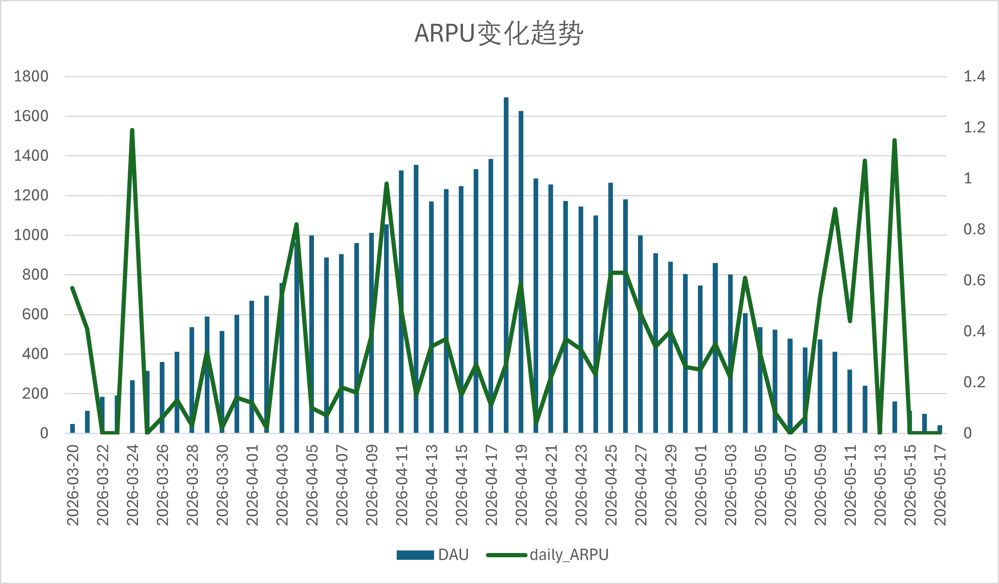
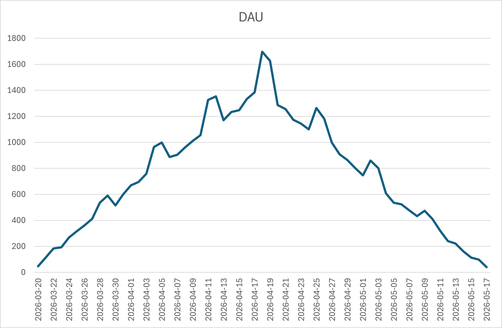
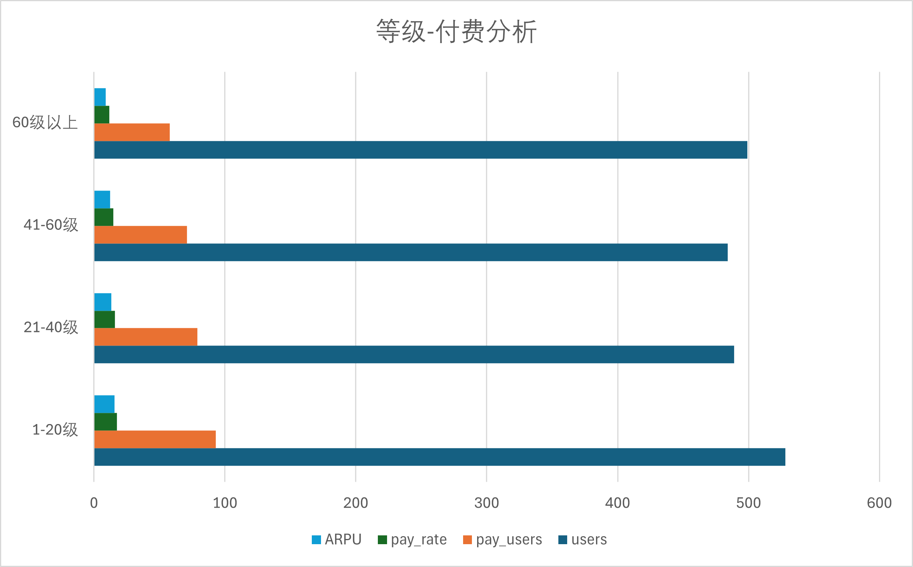
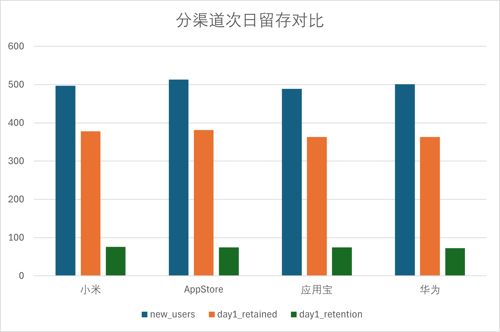
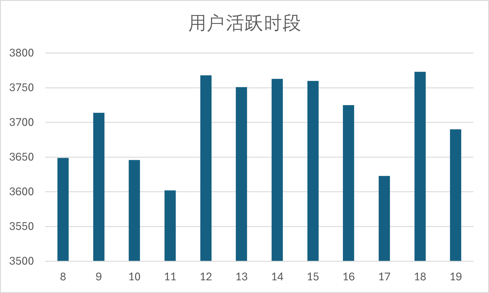

# 手游运营数据分析实战（Game Operations Data Analysis）
注：本项目为个人学习作品，数据均为模拟生成，不涉及任何公司真实数据。

> 模拟真实游戏运营场景，通过 SQL + Excel 完成用户行为、留存、付费等多维度数据分析，输出运营优化建议。

## 📌 项目背景

本项目以一款虚构的卡牌类手游《放置英雄》为分析对象，构建了包含 **2000名用户、45000+条登录日志、900+条付费记录** 的模拟数据库，完整复现了游戏上线首月的运营数据。通过 MySQL 进行数据提取与指标计算，并结合 Excel 进行可视化分析，最终产出一份具备业务价值的数据分析报告，为游戏运营决策提供数据支持。

## 🛠️ 技术栈

- **数据库**：MySQL 8.0
- **SQL 技能**：多表关联、聚合统计、窗口函数、留存计算、ARPU/ARPPU/LTV 计算
- **工具**：DataGrip（SQL 开发）、Excel（数据透视表、图表制作）
- **版本管理**：Git & GitHub

## 📊 核心指标与分析

### 1. 核心运营指标
- **DAU/MAU**：监测日活趋势，识别周末效应
- **留存率**：计算次日、7日留存，定位用户流失关键节点
- **ARPU / ARPPU**：评估整体与付费用户的收入贡献
- **付费率**：衡量用户付费转化水平
- **LTV 预估**：基于 ARPU 与留存曲线粗略估算用户生命周期价值

### 2. 多维度业务分析
- **分渠道质量评估**：对比 AppStore、华为、小米、应用宝四个渠道的用户规模、留存与付费质量
- **用户活跃时段分析**：识别登录高峰，为活动推送提供时间参考
- **等级与付费意愿关联**：发现 40 级以上用户 ARPU 是普通用户的 3 倍，为付费引导提供依据

## 📊 可视化图表预览

### 1. ARPU 变化趋势

### 2. DAU 趋势图

### 3. 等级-付费分析图

### 4. 分渠道次日留存对比

### 5. 用户活跃时段分布

**📬 联系我**
邮箱：553043978@QQ.COM
